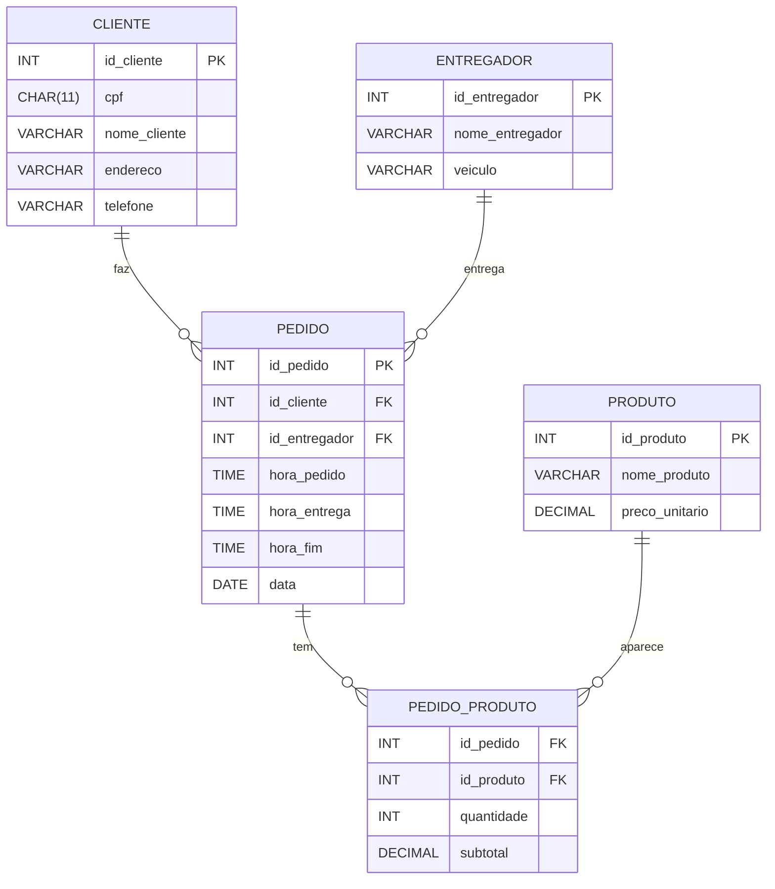

# Diagrama - Pedidos

```mermaid
erDiagram

    CLIENTE {
        INT id_cliente PK
        CHAR(11) cpf
        VARCHAR nome_cliente
        VARCHAR endereco
        VARCHAR telefone 
    }

    PEDIDO {
        INT id_pedido PK
        INT id_cliente FK
        INT id_entregador FK
        TIME hora_pedido
        TIME hora_entrega
        TIME hora_fim
        DATE data
    }

    PRODUTO {
        INT id_produto PK
        VARCHAR nome_produto
        DECIMAL preco_unitario
    }

    ENTREGADOR {
        INT id_entregador PK
        VARCHAR nome_entregador
        VARCHAR veiculo
    }

    PEDIDO_PRODUTO {
        INT id_pedido FK
        INT id_produto FK
        INT quantidade
        DECIMAL subtotal
    }

    CLIENTE ||--o{ PEDIDO : faz
    ENTREGADOR ||--o{ PEDIDO : entrega
    PEDIDO ||--o{ PEDIDO_PRODUTO : tem
    PRODUTO ||--o{ PEDIDO_PRODUTO : aparece
```
